

# 
Entrega de proyecto final

@Alumno: Matias Reynoso

@Comision: 53180

@Tutor: Santiago Angel Gonzalez Martin

@Docente: Anderson Michel Torres

---

## Indice

 - [Temática del Proyecto](#temática-del-proyecto)
 - [Modelo de Negocio](#modelo-de-negocio)
 - [Diagrama Entidad-Relación](#diagrama-entidad-relación)
 - [Listado de Tablas y Descripción](#listado-de-tablas-y-descripción)
 - [Ingesta de Datos](#ingesta-de-datos)
 - [Objetos de la Base de Datos](#objetos-de-la-base-de-datos)
   - [Documentación de Funciones](#documentación-de-funciones)
   - [Documentación de Triggers](#documentación-de-triggers)
   - [Documentación de Procedimientos Almacenados](#documentación-de-procedimientos-almacenados)
   - [Documentación de Vistas](#documentación-de-vistas)
   - [Roles, Permisos y Usuarios](#roles-permisos-y-usuarios)
 - [Backup de la Base de Datos](#backup-de-la-base-de-datos)
 - [Herramientas y Tecnologías Usadas](#herramientas-y-tecnologías-usadas)
 - [Instrucciones para Levantar el Proyecto en CodeSpaces GitHub](#instrucciones-para-levantar-el-proyecto-en-codespaces-github)
 - [Formato de Entrega](#formato-de-entrega)

---

## Tematica del proyecto

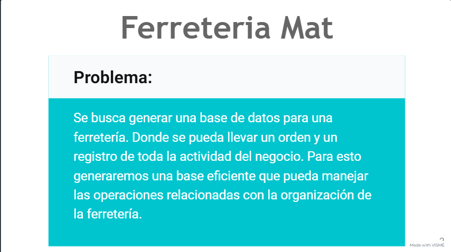

## Modelo de negocio

**Productos:**

La ferretería almacena una amplia variedad de productos como herramientas, materiales de construcción, productos eléctricos, y más.
La gestión de productos incluye mantener el inventario actualizado, ajustar precios y realizar pedidos a los proveedores.

**Proveedores:**

La ferretería trabaja con múltiples proveedores para obtener los productos necesarios.
La relación con los proveedores incluye la gestión de pedidos y el registro de información sobre el precio y disponibilidad de productos.

**Ventas:**

Las ventas se realizan a clientes finales que compran productos para sus necesidades personales o profesionales.
La gestión de ventas incluye registrar transacciones, actualizar el inventario y generar informes de ventas.

**Clientes:**

Los clientes pueden ser individuos o empresas que compran productos de la ferretería.
La gestión de clientes puede incluir mantener un registro de compras, contacto para promociones y seguimiento de satisfacción.

## Diagrama entidad relacion 

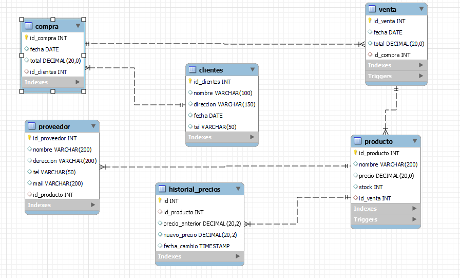

## Listado de tablas y descripcion

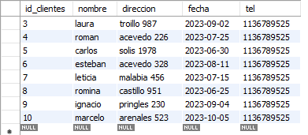

**Tabla clientes**

Contiene la información de los clientes que compran productos en la ferretería.

**id_cliente** (int, AI, PK): Identificador único para cada cliente.
**nombre** (varchar(100)): Nombre del cliente.
**direccion** (varchar(150)): Dirección del cliente.
**fecha** (date): Fecha en que el cliente fue registrado.
**tel** (varchar(50)): Teléfono de contacto del cliente.
**id_compra** (int, FK): Clave foránea que referencia a la tabla compra.

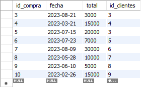

**Tabla compra**
Registra las compras realizadas por los clientes.

**id_compra** (int, AI, PK): Identificador único para cada compra.
**fecha** (date): Fecha en que se realizó la compra.
**total** (decimal(20, 2)): Monto total de la compra.
**id_cliente** (int, FK): Clave foránea que referencia a la tabla clientes.
sql

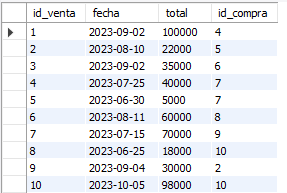

**Tabla venta**
Registra las ventas realizadas por la ferretería.

**id_venta** (int, AI, PK): Identificador único para cada venta.
**fecha**ate): Fecha en que se realizó la venta.
**total** (decimal(20, 2)): Monto total de la venta.
**id_compra** (int, FK): Clave foránea (si corresponde) que podría usarse para relacionar compras (dependiendo del contexto específico).

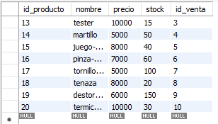

**Tabla producto**
Almacena información sobre los productos que la ferretería vende.

**id_producto** (int, AI, PK): Identificador único para cada producto.
**nombr** (varchar(200)): Nombre del producto.
**preci** (decimal(20, 2)): Precio del producto.
**stock**(int): Cantidad de producto disponible en inventario.
**id_venta** (int, FK): Clave foránea que referencia a la tabla venta.

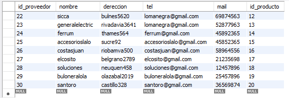

**Tabla proveedor**
Contiene la información de los proveedores de los productos.

**id_proveedor** (int, AI, PK): Identificador único para cada proveedor.
**nombre** (varchar(200)): Nombre del proveedor.
**direccion** (varchar(200)): Dirección del proveedor.
**tel** (varchar(200)): Teléfono de contacto del proveedor.
**mail** (varchar(50)): Correo electrónico del proveedor.
**id_producto** (int, FK): Clave foránea que referencia a la tabla producto.
sql

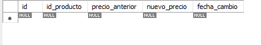

**Tabla historial_precios**
Registra los cambios en los precios de los productos a lo largo del tiempo.

**id** (int, AI, PK): Identificador único para cada registro de cambio de precio.
**id_producto** (int, FK): Clave foránea que referencia a la tabla producto.
**precio_anterior** (decimal(20, 2)): Precio del producto antes del cambio.
**nuevo_precio** (decimal(20, 2)): Nuevo precio del producto después del cambio.
**fecha_cambio** (timestamp): Fecha y hora en que se realizó el cambio de precio.

## Estructura e ingesta de datos

**Captura Inicial:** Los datos son ingresados manualmente.

**Validación:** Los datos son validados para asegurar que cumplen con los formatos y restricciones de la base de datos.

**Inserción/Actualización:** Los datos son insertados en las tablas correspondientes usando comandos SQL.

**Verificación:** Después de la inserción/actualización, se realizan verificaciones para asegurar que los datos se han ingresado correctamente.

**Monitoreo y Mantenimiento:** Se monitorean los datos para detectar y corregir cualquier inconsistencia, además de realizar mantenimientos periódicos para optimizar la base de datos.

## Objetos de la base de datos

Los objetos de la base de datos se ubican en la carpeta objects, con un archivo sql para cada tipo de objeto:
- Funciones : a_funtions.sql
- Triggers : b_triggers.sql
- Prodecimientos almacenados : c_stored_procedures.sql
- Vistas : d_views.sql
- Roles, permisos y usuarios : e_roles_users.sql 

A continuación, se desarrolla la documentación de cada uno de ellos.

### Documentación de Funciones 

---

### Listado de funciones

**Funcion 1 : calcular_total_ventas_producto**

**Funcionalidad de la Función**

**Objetivo:**

El objetivo de la función calcular_total_ventas_producto es proporcionar una forma sencilla de calcular el total de ventas de un producto específico durante un período determinado. Esto es útil para análisis de ventas y planificación de inventarios.

**Funcionalidad:**

La función toma el ID de un producto, una fecha de inicio y una fecha de fin como entrada, y devuelve el total de ventas del producto en ese período. Esto permite a los gerentes de ventas y de inventario evaluar rápidamente el rendimiento de un producto en un rango de fechas específico.

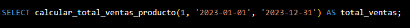

Con esta función, puedes calcular fácilmente el total de ventas de un producto específico durante un período determinado, proporcionando una herramienta útil para la gestión de ventas y la planificación de inventarios en la ferretería.

**Funcion 2 : calcular_total_ventas_cliente**

**Funcionalidad de la Función**

**Objetivo:**
El objetivo de la función calcular_total_ventas_cliente es proporcionar una forma sencilla de calcular el total de ventas de un cliente específico durante un período determinado. Esto es útil para análisis de ventas, fidelización de clientes y planificación de estrategias de marketing.

**Funcionalidad:**
La función toma el ID de un cliente, una fecha de inicio y una fecha de fin como entrada, y devuelve el total de ventas del cliente en ese período. Esto permite a los gerentes de ventas y de marketing evaluar rápidamente el rendimiento de un cliente en un rango de fechas específico.

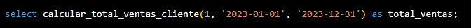

Con esta función, puedes calcular fácilmente el total de ventas de un cliente específico durante un período determinado, proporcionando una herramienta útil para la gestión de clientes y la planificación de estrategias de ventas en la ferretería.

### Documentación de Triggers 

---

### Listado de triggers

**Trigger 1 : after_venta_insert**

Actualizar el Stock del Producto al Realizar una Venta
Este trigger se activará después de insertar una nueva venta en la tabla venta y reducirá el stock del producto correspondiente en la tabla producto.

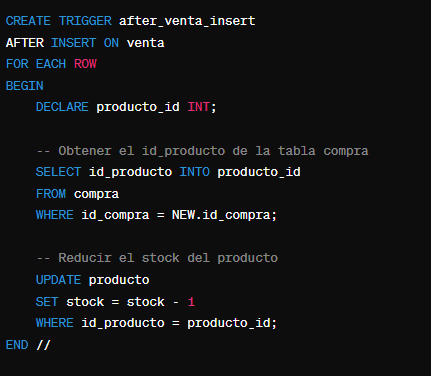

**Trigger 2 : before_producto_update**

Registrar el Historial de Precios de un Producto
Este trigger se activará antes de actualizar el precio de un producto en la tabla producto y registrará el cambio en una tabla de historial de precios.

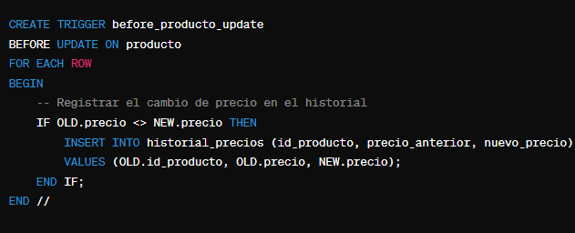

### Documentación de Procedimientos Almacenados

---

### Listado de procedimientos almacenados

**Procedimiento 1 : obtener_producto_mas_vendido**

**Objetivo:**
El objetivo del procedimiento almacenado obtener_producto_mas_vendido es proporcionar una forma sencilla y eficiente de acceder a la información del producto más vendido y su proveedor desde la base de datos de la ferretería.

 **Funcionalidad:**
La funcionalidad del procedimiento es ejecutar una consulta sobre la vista vista_producto_mas_vendido_proveedor y devolver el conjunto de resultados correspondiente. Esto facilita la obtención de información específica y útil sobre las ventas y los proveedores sin necesidad de escribir consultas SQL complejas cada vez que se necesita esta información.

Con este procedimiento almacenado, puedes obtener fácilmente la información del producto más vendido y su proveedor cada vez que lo necesites, simplificando el proceso de recuperación de datos específicos en la base de datos.

**Procedimiento 2 : obtener_stock_total_por_proveedor**

Funcionalidad del Procedimiento
Objetivo:
El objetivo del procedimiento obtener_stock_total_por_proveedor es proporcionar una forma sencilla y eficiente de obtener el stock total de todos los productos suministrados por un proveedor específico. Esto ayuda en la gestión de inventarios y la evaluación de las contribuciones de cada proveedor al negocio.

Funcionalidad:
La funcionalidad del procedimiento es recibir un proveedor_id como parámetro de entrada y devolver una lista de productos suministrados por ese proveedor, incluyendo el stock disponible y otros detalles relevantes del producto y del proveedor. Esto permite a los gestores de inventario y a los responsables de compras evaluar rápidamente la cantidad de stock disponible de cada proveedor.

Este procedimiento permitirá obtener fácilmente el stock total de los productos suministrados por un proveedor específico, ayudando en la toma de decisiones relacionadas con la gestión de inventarios y las relaciones con los proveedores.

**Procedimiento 3 : registrar_venta_y_actualizar_stock**

**Objetivo**
El objetivo del procedimiento almacenado registrar_venta_y_actualizar_stock es automatizar el proceso de registrar una nueva venta en la base de datos de la ferretería y actualizar el stock del producto vendido. Este procedimiento garantiza que ambas operaciones (registro de venta y actualización del stock) se realicen de manera atómica, lo que significa que ambas deben completarse exitosamente o ninguna de ellas se ejecutará. Esto ayuda a mantener la integridad de los datos y evita inconsistencias.

**Funcionalidad**
Registro de Venta: Inserta una nueva entrada en la tabla venta con la información de la venta, como la fecha de la venta, el total de la venta y la referencia a la compra asociada.

Actualización del Stock: Reduce el stock del producto vendido en la tabla producto según la cantidad vendida.

Gestión de Transacciones: Utiliza transacciones para asegurar que ambas operaciones (registro de venta y actualización del stock) se completen de manera consistente.

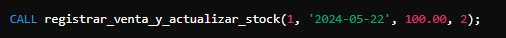

Con este procedimiento almacenado, puedes registrar una venta y actualizar el stock del producto en una única operación, asegurando que siempre haya suficiente stock antes de registrar la venta.

### Documentación de Vistas

---

### Listado de Vistas

**Vista 1 :  vista_clientes_compras**

Esto te proporcionará una combinación de datos de los clientes y sus compras, facilitando el análisis de la información en una sola consulta.

**Vista 2 :  vista_productos_proveedores**

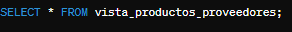

Esto te proporcionará una combinación de datos de los productos y sus proveedores, facilitando el análisis de la información en una sola consulta.

**Vista 3 :  vista_producto_mas_vendido_proveedor**

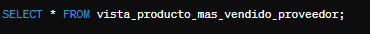

Esta vista te proporcionará una combinación de datos del producto más vendido y su proveedor, facilitando el análisis de la información en una sola consulta.

## Roles y permisos

Se generaron los siguientes roles:

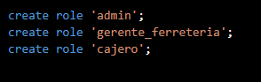

Y los siguientes permisos:

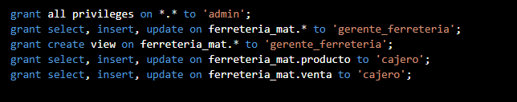

**Administrador (admin):** Tiene todos los permisos, incluyendo la creación y modificación de tablas, vistas, funciones y triggers.

**Gerente de Ferreteria:** Puede ver y modificar datos relacionados con ventas y clientes, pero no puede modificar la estructura de la base de datos.

**Cajero:** Puede insertar y actualizar registros de ventas y productos, pero no puede eliminar registros ni modificar la estructura de la base de datos.

## Back up de la base de datos

## Herramientas y tecnologias usadas

* MySQL (motor de bases de datos, version 8.0.36)
* MySQL Workbench (interfaz gráfica, version 8.0.36)
* Makefile (para generar una interfaz sencilla de procesos)
* Docker (para generar un container)
* GitHub (para entregar el proyecto)

## Como levantar el proyecto en CodeSpaces GitHub
* env: Archivo con contraseñas y data secretas
* Makefile: Abstracción de creacción del proyecto
* docker-compose.yml: Permite generar las bases de datos en forma de contenedores

#### Pasos para arrancar el proyecto

* En la terminal de linux escribir :
    - `make` _si te da un error de que no conexion al socket, volver al correr el comando `make`_
    - `make clean-db` limpiar la base de datos
    - `make test-db` para mirar los datos de cada tabla
    - `make backup-db` para realizar un backup de mi base de datos
    - `make access-db` para acceder a la base de datos
